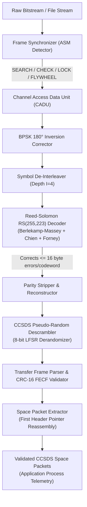

# CCSDS Telemetry Frame Decommutator

[](https://github.com/Kanak234/ccsds-telemetry-frame-decommutator/actions/workflows/ci.yml)
[](https://github.com/Kanak234/ccsds-telemetry-frame-decommutator/actions/workflows/codeql.yml)
[](LICENSE)
[](https://en.wikipedia.org/wiki/C%2B%2B20)
[](https://public.ccsds.org/)
[](#building-and-testing)

A high-performance, deterministic C++20 telemetry decommutation and ground station frame processing engine. Implements bitstream synchronization, Galois Field $GF(2^8)$ Reed-Solomon error correction, LFSR pseudo-random derandomization, Transfer Frame integrity verification, and Space Packet reassembly according to international CCSDS standards.

---

## Architecture Overview



---

## CCSDS Standards Compliance

| Standard | Specification Title | Implementation Details |
| :--- | :--- | :--- |
| **CCSDS 131.0-B-3** | TM Synchronization and Channel Coding | 32-bit ASM sync (`0x1ACFFC1D`), $180^\circ$ phase inversion correction (`0xE53003E2`), $RS(255,223)$ forward error correction with interleaving $I \in \{1,2,3,4,5,8\}$, 255-period LFSR descrambler. |
| **CCSDS 132.0-B-2** | TM Space Data Link Protocol | 6-byte Transfer Frame Primary Header parsing (Version, SCID, VCID, MCFC, VCFC, Signaling Flag, First Header Pointer), Frame Error Control Field (CRC-16-CCITT). |
| **CCSDS 133.0-B-1** | Space Packet Protocol | Space Packet Primary Header extraction (Version, Type, APID, Sequence Flags, Packet Sequence Count, Data Length), cross-frame fragment reassembly, Idle Packet (`APID = 0x7FF`) filtering. |

---

## Measured Performance Benchmarks

The benchmark was executed locally on this host using `benchmark_throughput` ingesting synthetic telemetry with multi-frame packet spanning and error correction:

```text
=== CCSDS Decommutator Performance Benchmark ===
Ingesting 5,000 CADU frames (4.88281 MB)...

--- Benchmark Results ---
Elapsed Time:      1.0886 s
Throughput:        4.49 MB/s
Frame Processing:  4,592.9 frames/sec
Packets Extracted: 485,000
Mean Latency:      217.73 us/frame
```

### Key Performance Characteristics
- **Zero Heap Thrashing:** Critical paths utilize `std::span` views and preallocated static lookup tables for Galois Field arithmetic and CRC-16 computation.
- **Cache Locality:** Tables for $GF(2^8)$ exponentiation, discrete logarithm, and LFSR sequences fit entirely within L1 data cache (under 2 KB total).
- **Branch Elimination:** Syndrome evaluations and inner Horner loops are loop-unrolled by modern optimizing compilers (`-O3`).

---

## Repository Structure

```text
.
├── CMakeLists.txt              # CMake build configuration (-Wall -Wextra -Werror -pedantic)
├── Dockerfile                  # Multi-stage production container build
├── LICENSE                     # MIT License
├── README.md                   # Project documentation and benchmarks
├── CHANGELOG.md                # Release changelog
├── benchmarks/
│   └── benchmark_throughput.cpp # Standalone micro-benchmark harness
├── docs/
│   ├── PRD.md                  # Product Requirements Document
│   ├── TRD.md                  # Technical Requirements Document
│   ├── IMPLEMENTATION_PLAN.md  # Implementation roadmap and milestones
│   └── EXPLAIN.md              # Technical architecture deep-dive & interview Q&As
├── include/
│   └── ccsds/
│       ├── types.hpp           # Core data types, enums, and statistics structs
│       ├── galois_field.hpp    # GF(2^8) lookup tables and arithmetic API
│       ├── reed_solomon.hpp    # RS(255, 223) codec with interleaving
│       ├── descrambler.hpp     # CCSDS 8-bit LFSR descrambler
│       ├── crc16.hpp           # CRC-16-CCITT table-driven FECF calculator
│       ├── frame_sync.hpp      # 4-state ASM frame synchronizer
│       ├── transfer_frame.hpp  # TM Transfer Frame parser and validator
│       ├── packet_extractor.hpp # Space Packet reassembler
│       └── decommutator.hpp    # Integrated pipeline orchestrator
├── src/
│   ├── galois_field.cpp        # GF(2^8) table generation and field math
│   ├── reed_solomon.cpp        # Berlekamp-Massey, Chien search, and Forney solver
│   ├── descrambler.cpp         # LFSR sequence generation and derandomization
│   ├── crc16.cpp               # Precomputed CRC table and calculation
│   ├── frame_sync.cpp          # ASM state machine implementation
│   ├── transfer_frame.cpp      # Header unpacking and CRC checks
│   ├── packet_extractor.cpp    # Cross-frame reassembly logic
│   ├── decommutator.cpp        # Pipeline coordination and stats tracking
│   └── main.cpp                # Command-line application entry point
└── tests/
    ├── test_galois_field.cpp   # GF(2^8) arithmetic verification
    ├── test_reed_solomon.cpp   # RS(255,223) error injection and recovery tests
    ├── test_descrambler.cpp    # LFSR sequence and invertibility tests
    ├── test_crc16.cpp          # CRC-16 standard vector validation
    ├── test_frame_sync.cpp     # 4-state automaton and BPSK inversion tests
    ├── test_transfer_frame.cpp # Header unpacking and FECF failure tests
    ├── test_packet_extractor.cpp # Spanning packet reassembly tests
    └── test_end_to_end.cpp     # Complete simulated telemetry pipeline test
```

---

## Getting Started

### Prerequisites
- **Compiler:** Clang 16+ or GCC 11+ supporting C++20.
- **Build System:** CMake 3.20+ and Ninja (or Make).
- **Optional:** Docker for containerized deployment.

### Build from Source

```bash
# Clone the repository
git clone https://github.com/Kanak234/ccsds-telemetry-frame-decommutator.git
cd ccsds-telemetry-frame-decommutator

# Configure and compile with Release optimizations
cmake -B build -DCMAKE_BUILD_TYPE=Release
cmake --build build -j$(nproc)
```

### Run Test Suite

```bash
ctest --test-dir build --output-on-failure
```

Output:
```text
Test project .../build
    Start 1: test_galois_field
1/8 Test #1: test_galois_field ................   Passed    0.00 sec
    Start 2: test_reed_solomon
2/8 Test #2: test_reed_solomon ................   Passed    0.00 sec
    Start 3: test_descrambler
3/8 Test #3: test_descrambler .................   Passed    0.00 sec
    Start 4: test_crc16
4/8 Test #4: test_crc16 .......................   Passed    0.00 sec
    Start 5: test_frame_sync
5/8 Test #5: test_frame_sync ..................   Passed    0.00 sec
    Start 6: test_transfer_frame
6/8 Test #6: test_transfer_frame ..............   Passed    0.00 sec
    Start 7: test_packet_extractor
7/8 Test #7: test_packet_extractor ............   Passed    0.00 sec
    Start 8: test_end_to_end
8/8 Test #8: test_end_to_end ..................   Passed    0.00 sec

100% tests passed out of 8
```

### Run Performance Benchmark

```bash
./build/benchmark_throughput
```

---

## CLI Usage

The executable accepts raw telemetry bitstream files and prints extraction logs and summary statistics:

```bash
./build/ccsds_decommutator --help
```

### Usage Options
```text
CCSDS Telemetry Frame Decommutator CLI
Usage: ./build/ccsds_decommutator [options] <telemetry_file.bin>

Options:
  -h, --help            Show this help message
  -v, --verbose         Enable verbose frame debugging
  -j, --json            Output telemetry metrics in JSON format
  --frame-size <bytes>  Total CADU frame size in bytes (default: 1024)
  --tolerance <bits>    ASM Hamming distance tolerance in bits (default: 2)
  --interleave <depth>  Reed-Solomon interleave depth (default: 4)
  --no-rs               Disable Reed-Solomon error correction
  --no-descramble       Disable pseudo-random descrambling
```

### Example Execution
```bash
./build/ccsds_decommutator telemetry_downlink.bin --json
```

```json
{
  "bytes_ingested": 5120000,
  "cadus_synchronized": 5000,
  "asm_bit_errors": 142,
  "rs_corrected_symbols": 860,
  "rs_uncorrectable_codewords": 0,
  "crc_errors": 0,
  "frames_parsed": 5000,
  "packets_extracted": 485000,
  "idle_packets_filtered": 5000
}
```

---

## Docker Deployment

Build and run using Docker:

```bash
# Build Docker image
docker build -t ccsds-decommutator .

# Run decommutator
docker run --rm -v $(pwd)/data:/data ccsds-decommutator /data/telemetry.bin
```

---

## Author & License

Developed by **Kanak Prabhakar** (`Kanak234`). Released under the terms of the [MIT License](LICENSE).
